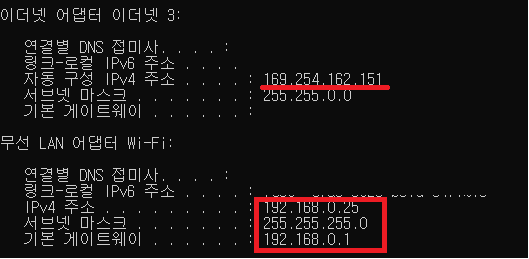
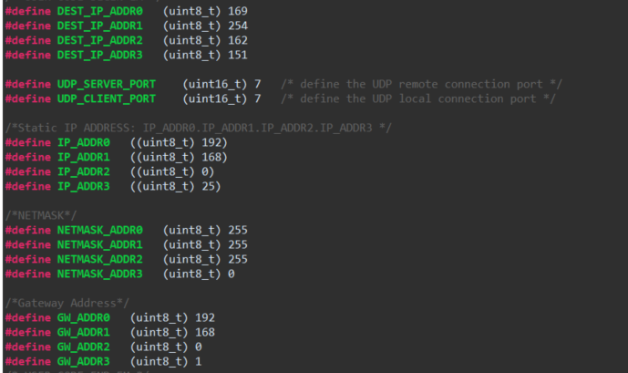
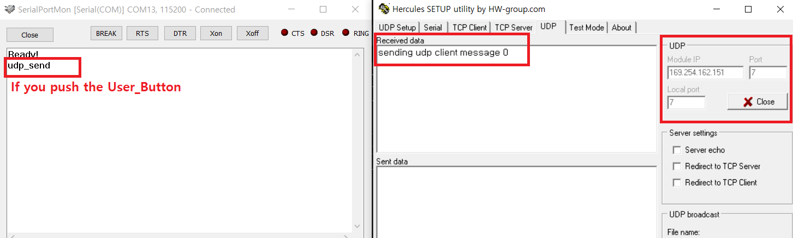
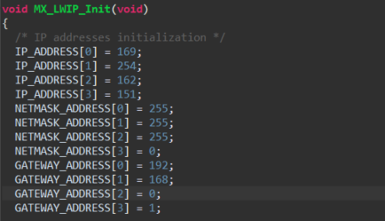
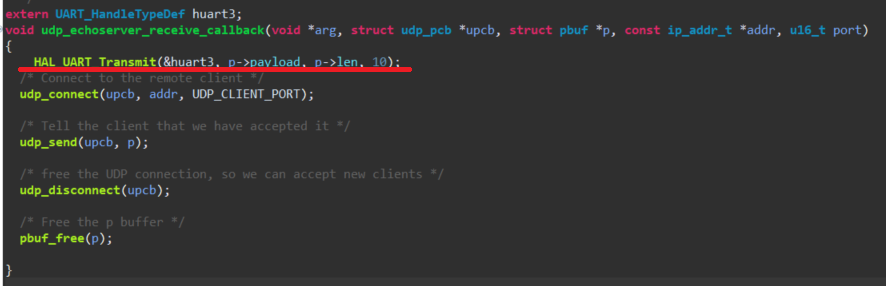
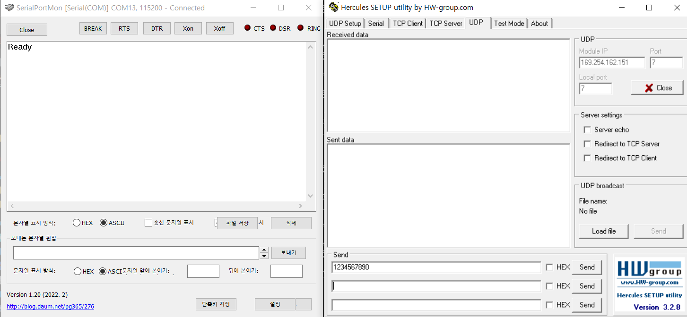
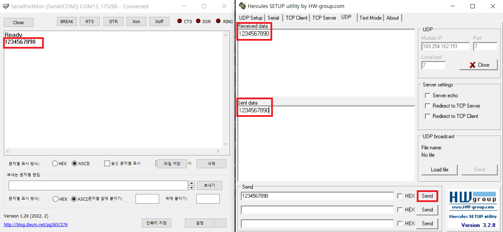

# STM32F429ZI_UDP_RECEIVE_SEND
Nucleo-F429ZI LwIP 스택(RAW API)을 사용하는 UDP 송수신 구현입니다. 

## 개발환경

프로젝트에 사용된 환경입니다. 
- 디바이스 : Nucleo-F429ZI (STM32F429ZI) 
- 개발환경 : CUBEIDE 
- 사용언어 : C 
- 사용기능 : UART, LwIP, UDP 
- 통신프로그램 : Hercules, SerialPortMon 

## 사용 및 변경법

LAN선은 MCU-PC 직접연결하였습니다. 
프로젝트에 사용된 IP는 CMD의 ipconfig로 확인하여 수정하여 사용가능합니다. 
 
SEND : MCU에서 USER_BUTTON을 누르면 데이터를 전송합니다. 
RECEIVE : PC에서 데이터를 보낼 시, MCU에서 데이터를 수신합니다. 

## ipconfig설정

 

## 송신모드 시 main.h 변경

  

## 송신 결과

  

## 수신모드 시 변경

  

## 수신 시, UART로 전송되는 코드

  

## 수신 결과

  

  

 

## License
(C) 2023 PETABREW. Author : sehwan.park. Version : Ver 0.1
